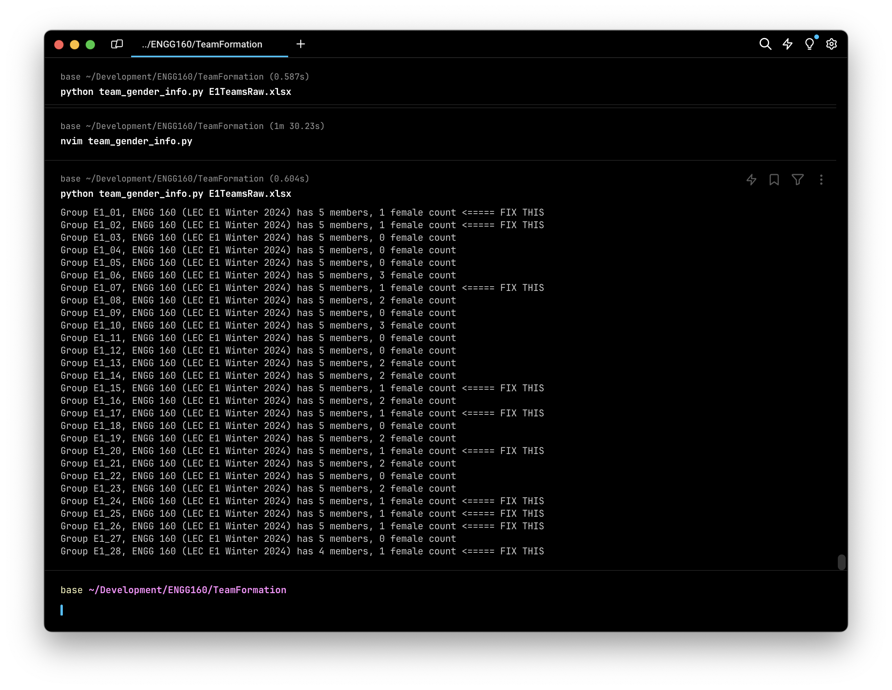

# ENGG 160 Team Formation
The objective is to form teams of N students and ensure that any team with females has at least 2.

## Generate groups in ENGG 160 eClass

1. Switch to the Participants tab (very top of page)
2. Select the Groups view
3. Select the desired lecture section. For this example it will be `E1`
4. Click "Auto-create groups"
5. For Naming Scheme replace "Group @" with "lecture section\_#"; e.g., with `E1_#`
6. Set "Auto create based on" to `Members per group`
7. Set "Group/member count" to the desired number; e.g. `5`
8. Set "Group messaging" to `Yes`
9. Set "Select members with role" to `Student`
10. Leave "Select members from grouping" as `None`
11. Set "Select members from group" to the matching lecture section; e.g., `ENGG 160 (LEC E1 Winter 2024)`
12. Set "Allocate members" to `Randomly`
13. Make sure "Include only active enrolments" is checked (selected)
14. Under the Grouping section, make sure that "Grouping of auto-created groups" is set to `No grouping`
15. Click "Preview" to see if the groups are created and look okay.
16. If they are okay, click "Submit"
	1. Note, you can always delete any or all of the groups if there are problems.

This results in groups with names that start with `E1_` and have one or two digits for the group number; either 1-9 or 10-xx. This is not so nice for the next steps, so in the Groups view manually change any single digit to two digits with a leading 0. E.g., `E1_3` becomes `E1_03`.


## Checking the number of females in groups
This is done on a per section basis.

We will need an Excel spreadsheet with all the groups in the lecture section. Generating it in eClass is easy, but it will not have the student gender.

We will need to merge the gender from a separately generated lecture section list with the one generated in eClass.

### Phase 1 - Preparation

#### 1.1 Generating a Master Spreadsheet with Group information
First we get a master spreadsheet for the lecture section we're working with, which in this guide is `E1`. We generate it in eClass and it will include the Groups information.
1. Switch to the Participants tab (very top of page)
2. Use the filter to look people in the lecture section group, e.g., `ENGG 160 (LEC E1 Winter 2024)`, and for people with the role `Student`
3. Select all the students in the result and export to an Excel spreadsheet
4. Open the spreadsheet in Excel; it will have a name like `courseid_93511_participants.xlsx`
5. Sort all of the rows by Student ID
	1. Select the Student ID column and under the Data menu select Sort
		1. In the warning, select "Expand selection" and click "Sort..."
	2. In the dialogue select "Student ID" and click Okay
	3. In the next dialogue make sure "Sort anything that looks like a number, as a number" and click OK
6. Save the spreadsheet

#### 1.2 Copying the gender information into the Master Spreadsheet
Now we need to open the class list with gender and copy the gender column to the spreadsheet we just prepared. The main step before copying that information is to make sure the second spreadsheet is sorted by Student ID
1. Open in Excel the class list spreadshee that has gender information.
	1. It may have a name like `ENGG_160_E1_List.xlsx`. Be sure to check you have the right lecture section and the spreadsheet has "Sex" as a column
2. Sort all of the rows by Student ID
	1. Select the Student ID column and under the Data menu select Sort
		1. In the warning, select "Expand selection" and click "Sort..."
	2. In the dialogue select "Student ID" and click Okay
	3. In the next dialogue make sure "Sort anything that looks like a number, as a number" and click OK
6. Save the spreadsheet
7. Do a visual check against the master spreadsheet that has the Groups information and was sorted just like the current spreadsheet. 
	1. First, make sure the number of students matches in each
	2. Then do spot check that the same name is on the same row in both. Five or ten checks of that should do
8. Copy the column with the heading "Sex" from this spreadsheet and past it in the first open column at the right of the master spreadsheet. 
9. Save the master spread sheet

*NOTE* We can check that the two spreadsheets are consistent by sorting them both for "Sex". Between the two spreadsheets there should be the same number of females and the names should match.

### Phase 2 - Checking the Master Spreadsheet for groups with 1 females

In this phase we use a Python program to flag the groups with 1 female teammate. We will note that information and use it to swap teammates to correct the problem so that no team has fewer than 2 women.

1. The master spreadsheet needs to be sorted by Groups.
	1. Follow the example above, but select as the sort key "Groups"
	2. Save the sorted spreadsheet, giving it a name like `E1TeamsRaw.xlsx`. This is the input for the Python program

Move the sorted spreadsheet to the same directory as the `team_gender_info.py` program. 
Run the program by typing 
```
python team_gender_info.py E1TeamsRaw.xlsx
```
The result should resemble the output shown in Figure 1. Use the output to identify teams with only one female and correct in eClass by swapping membership.

Figure 1 Example output indicating which teams have only one female.


	